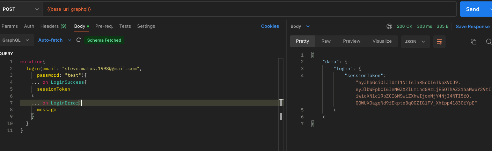
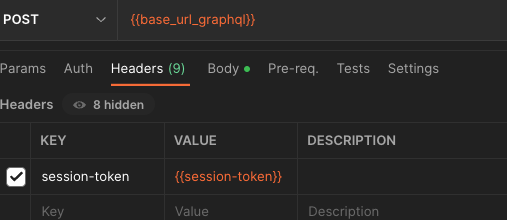
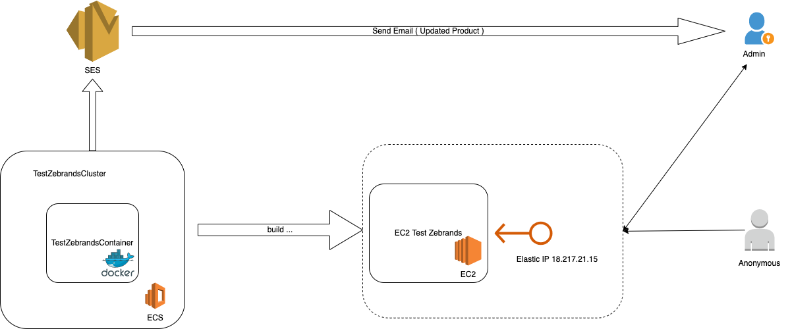

# Test Zebrands

## Description
---
API GraphQL for Catalog System written with Python using FastAPI, SQL Alchemy, Strawberry.

The project this deployed in http://18.217.21.15:8000/graphql

### Construction 🛠️
* **Language:** Python 3
* **Technologies:** FastAPI, SQL Alchemy, Strawberry
* **Database:** SQLite

## Requirements
---
- Docker installed

## Installation and execution
---
Clone or Fork the project.

Run ```docker-compose``` command inside **docker-python** folder.

* Building the containers: ```docker-compose build```

* Starting the services: ```docker-compose up -d```

* Stoping the services: ```docker-compose stop```

By default the service will run under the following port:
- my_store_service: 8000

## Project Structure
---
The following diagram describe the project structure used for this API
```
my_store
│   .gitignore
│   README.md
│   docker-compose.yml
│   .pre-commit-config.yaml
│   .flake8
│
└───app
│   │   .env.test
│   │   main.py
│   │
│   └───config                  Contains system settings
│   │   │
│   │   └───aws.py              Functions to manage aws (ses)
│   │   │
│   │   └───constants.py        Constants used in the project
│   │
│   │   └───database.py         Functions and constants for manage database
│   │
│   │   └───exceptions.py       Contains the custom exceptions for project
│   │
│   │   └───environment.py      Environment variables
│   │
│   └───gql                     Contains the definition of the mutations and queries of the Graphql
│   │
│   │   ...
│   │
│   └───models                  Contains the models for database
│   │
│   │   ...
│   │
│   └───schemas                 Contains the most complex data structures.
│   │   │
│   │   └───graphql             Contains data structures for graphql
│   │   │
│   │   │   ...
│   │   │
│   │   └───pydantic            Contains pydantic data structures used in the project
│   │
│   │       ...
│   │
│   └───services                The application service layer
│   │
│   │   ...
│   │
│   └───utils                   Functions utils
│   │
│   │   ...
│   │
│   └───test
│
└────────────
...

```

## Documentation
---

In graphql the documentation is in the same console so if you want to review the doc, just go to the endpoint http://localhost:8000/graphql

But there is a [documentation on Postman](documentation/zebrands_test.postman_collection.json) if you want to check it out.

### Authentication

This project will use jwt authentication with permission class in strawberry (Framework of GraphQL)

For authentication:



With the access token, you just put in the headers in the query to the graphql endpoint:



#### Note 🔍
There is already a user created for the admin with the credentials:
```
email: "steve.matos.1998@gmail.com"
password: test
````

## Development

Requeriments:
- pipenv installed

If you want to run the project to develop , you can run the following commands:
```shell
   cd app

   pipenv install --dev

   pipenv shell
```

Run with uvicorn in the app folder:

```shell
   uvicorn main:app --reload
```

If you want to contribute to the project, Remember that pre-commit is used for uniform code styling, so you'll need to **install the pre-commit**.

## Testing ⚙️

To run the tests:

```shell
   cd app

   pipenv install --dev

   pipenv shell

   python -m pytest
```

## Deploy

This project is deployed in aws with ECS (Elastic Container Service).

Application architecture is as follows:



#### Note 🔍
For sending mail, the sandbox version of SES is being used in the deploy, so it can only be sent to manually verified users in the identities,
for the moment the only user verified in SES is ```steve.matos.1998@gmail .com```


### Authors ✒️

* **Author:** Steve Matos, <steve.matos.1998@gmail.com>
